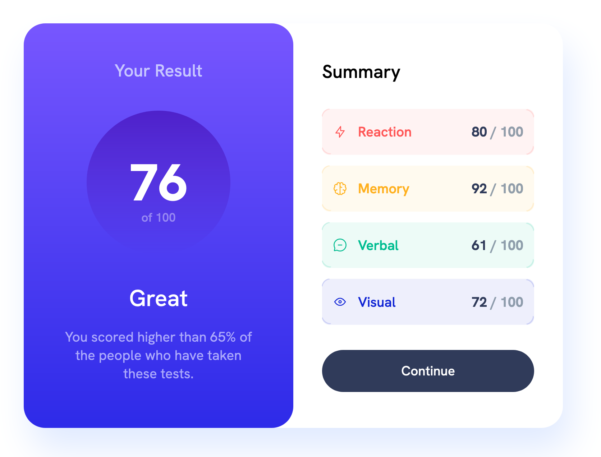

# Frontend Mentor - Results summary component solution

This is a solution to the [Results summary component challenge on Frontend Mentor](https://www.frontendmentor.io/challenges/results-summary-component-CE_K6s0maV). Frontend Mentor challenges help you improve your coding skills by building realistic projects. 

## Table of contents

- [Overview](#overview)
  - [The challenge](#the-challenge)
  - [Screenshot](#screenshot)
  - [Links](#links)
- [My process](#my-process)
  - [Built with](#built-with)
  - [What I learned](#what-i-learned)
  - [Continued development](#continued-development)
- [Author](#author)

## Overview

### The challenge

Users should be able to:

- View the optimal layout for the interface depending on their device's screen size
- See hover and focus states for all interactive elements on the page

### Screenshot



### Links

- Solution URL: [https://github.com/madosy/results-summary-component](https://github.com/madosy/results-summary-component)
- Live Site URL: [https://madosy.github.io/results-summary-component/](https://madosy.github.io/results-summary-component/)

## My process

### Built with

- Semantic HTML5 markup
- CSS custom properties
- Flexbox
- CSS Grid
- Mobile-first workflow
- Vanilla JS

### What I learned
- Reinforcing knowledge of flexbox and grid layout
- Paying attention to semantic HTML5 markup
- Using data file to update content
- Using vw to control how content looks.
- How to add a transition to a gradient button. Normally gradient backgrounds are not a transitional property. So, I had to create a pseudo element with opacity of 0 that becomes visible when the button becomes active:
  ```css
  button::before {
    transition: opacity 0.3s ease;
    opacity: 0;
  }
  button:active::before {
    opacity: 1;
  }

## Author

- Website - [Dasom](https://github.com/madosy)
- Frontend Mentor - [@madosy](https://www.frontendmentor.io/profile/madosy)